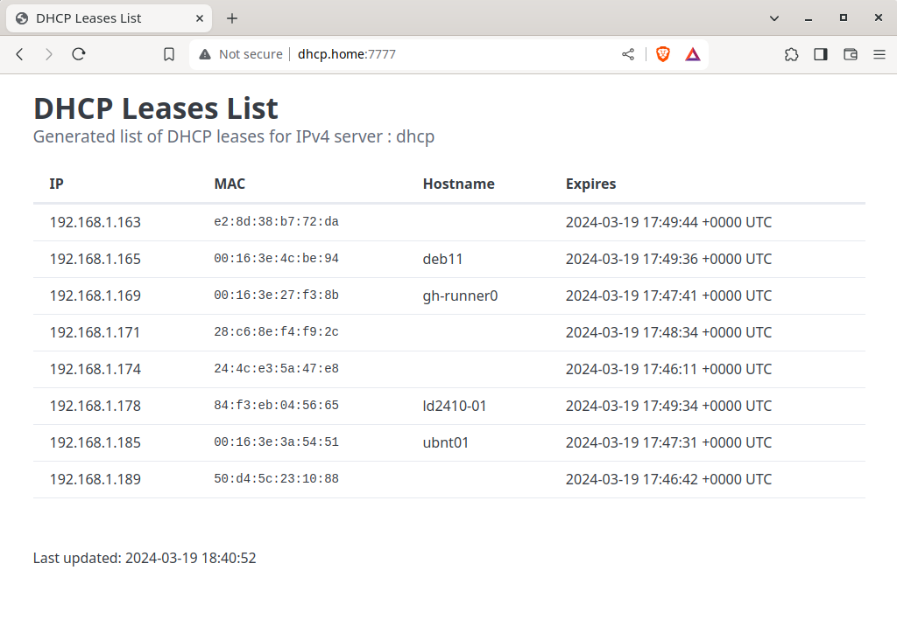

# HTTP-Leases

Simple webpage showing the list of DHCP leases on a server.

 

## Notes
 - Tested only with [ISC DHCP](https://www.isc.org/dhcp/) server.
 - No configuration file right now. Open your browser on http://server:7777.
 - Only a single binary file (6.9MB). CSS, template are included in the binary.

## TODO
 - Add support for IPv6.
 - Add command line option to change http port.

