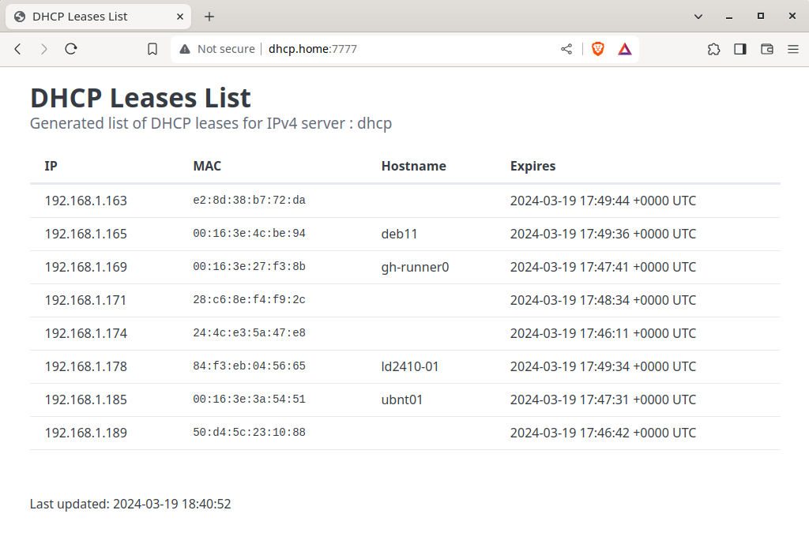

# HTTP-Leases (dnsmasq version)

Simple webpage showing the list of DHCP leases on a server.

 

## Notes
 - Tested only with [DNSMASQ](https://thekelleys.org.uk/dnsmasq/doc.html) server.
 - No configuration file right now. Open your browser on http://server:7777.
 - Only a single binary file (6.9MB). CSS, template are included in the binary.

## TODO
 - Add command line option to change http port.

